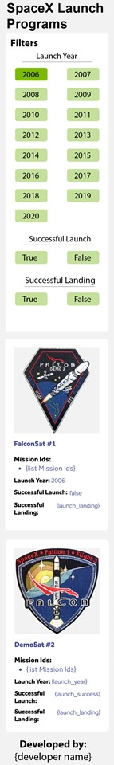
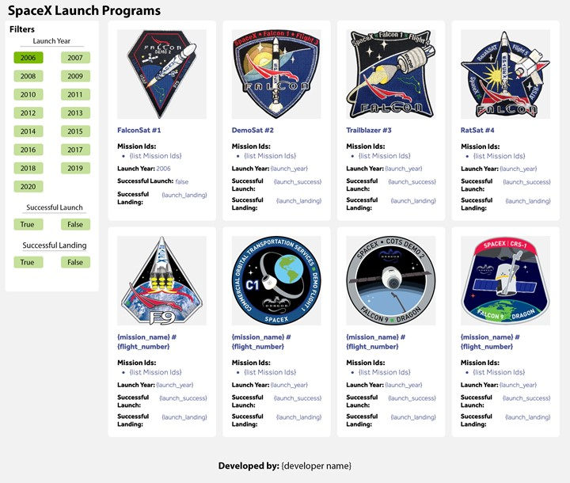

**PS - XT Coding Assignment**

**Problem statement:** _Develop a front-end application which would help users list and browse all launches by SpaceX program._

**Important API information that would help you to fetch the data**

| API end point for the first-time page load without any Filters: | API end point with Filters applied: |
| --- | --- |
| [https://api.spaceXdata.com/v3/launches?limit=100](https://api.spaceXdata.com/v3/launches?limit=100) | **Launch Success Filter:** [https://api.spaceXdata.com/v3/launches?limit=100&launch\_success=true](https://api.spaceXdata.com/v3/launches?limit=100&launch_success=true) **Launch & Land Filter:**
[https://api.spaceXdata.com/v3/launches?limit=100&launch\_success=true&land\_success=true](https://api.spaceXdata.com/v3/launches?limit=100&launch_success=true&land_success=true) **All:** [https://api.spaceXdata.com/v3/launches?limit=100&launch\_success=true&land\_success=true&launch\_year=2014](https://api.spaceXdata.com/v3/launches?limit=100&launch_success=true&land_success=true&launch_year=2014) |

## **Assignment Requirements:**

- Functionalities

1. The initial launch programs landing page ideally should be server-side-rendered.
2. A boilerplate to implement the Server-side rendering can be used.
3. User should be able to Filter the results with help of provided Filters.

- Filter options are hard coded with the values shown in the visual comp below.
- Applying any Filter should reflect the below changes:
  - Selected filter should change to selected state as shown in the visual comp.
  - Applied filters should change the URL and update the Page with latest records without refreshing the page.

- Responsive Design and other UI elements.
  1. Page should visually match with the provided designs at the end of this file.
  2. Responsive Behavior – Expectation is to do a custom media query implementation and not use bootstrap or similar responsive framework:
    - Implementation should follow Mobile first design approach
    - **Mobile View:** Page should have only one Column until 700 px. We have provided the Visual designs for Mobile screen.
    - **Tablet View:** Page should have 2 columns between 700 and 1024 px. Design is provided for Desktop tile and that should be followed for this viewport.
    - **Desktop View:** Page should have 4 columns between 1024 and 1440 px. Beyond 1440px viewport, the content will be centered align with a max width of 1440.
- On git - elaborate your approach and stack details in the Readme file.

**The ask:**

1. Develop a responsive layout matching the visual comps provided. The tablet version to have a 2-column product tile layout.
2. Unit tests for Components to test the functionalities will be a bonus.
3. Incorporate all performance best practices and demonstrate a high Lighthouse score for Performance, SEO and Accessibility, and share the same as part of the readme file through screenshots.

**Submission**

1. Create a GitHub repo with all best practices to share the code.
2. Share the link to the Github Repo and detail the setup instructions in the readme file.
3. Preference is also to deploy the code to your preferred hosting platform, eg: - Heroku, and share the deployed URL of the app.

**Visual Designs for the assignment on the next 2 pages.**

| **MOBILE VIEW** |  |
| --- | --- |

**DESKTOP VIEW**

